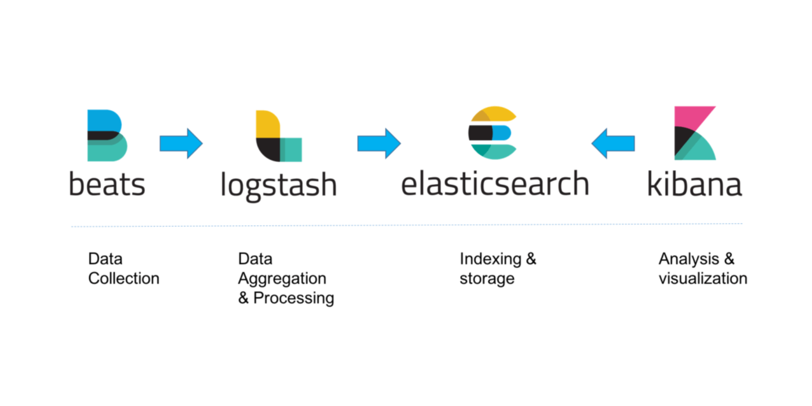

# ELK Stack
ELK Stack on Ubuntu 20.04 (LTS)

## What is ELK Stack? 
ELK Stack is a collection of open-source software that allows the user to search, analyze, and visualize logs. The generation of logs is from any source in any format, a practice called centralized logging.

### Important Components of ELK Stack

- **Elasticsearch:** It is a distribution of restful search engine which allows storing of all of the collected data.
- **Logstash:** It is a data processing component of the Elastic Stack, it sends the incoming data to Elasticsearch.
- **Kibana:** A web interface for searching as well as visualizing logs.
- **Beats:** This is a lightweight, single-purpose data shipper. It sends data from thousands of machines to Logstash or Elasticsearch.

  

## Prerequisites
### Server Type / Size
- Ubuntu 20.04 
- 4GB RAM / 2 CPUs

### Packages
- OpenJDK 11
- Nginx

